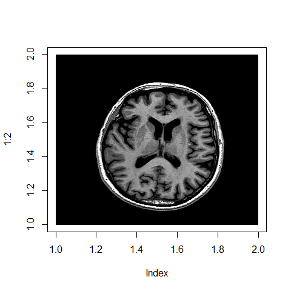
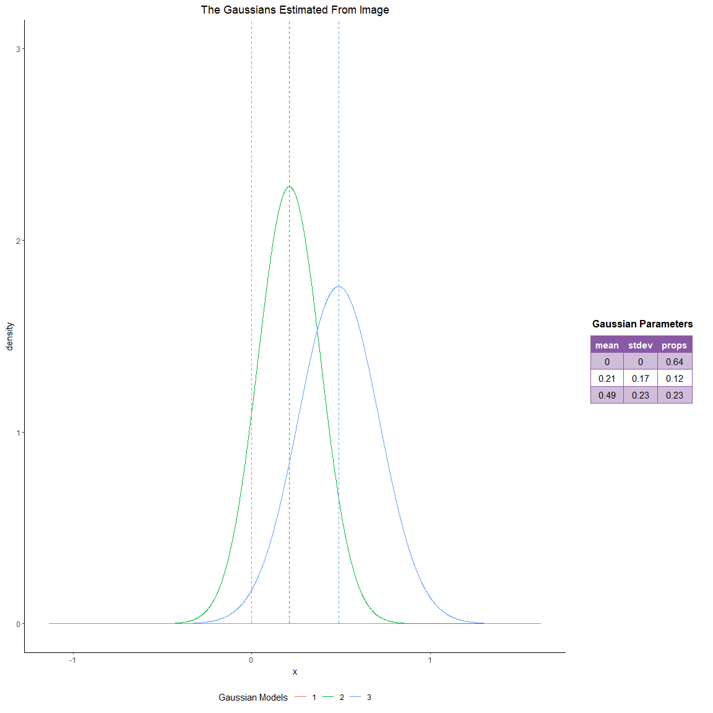
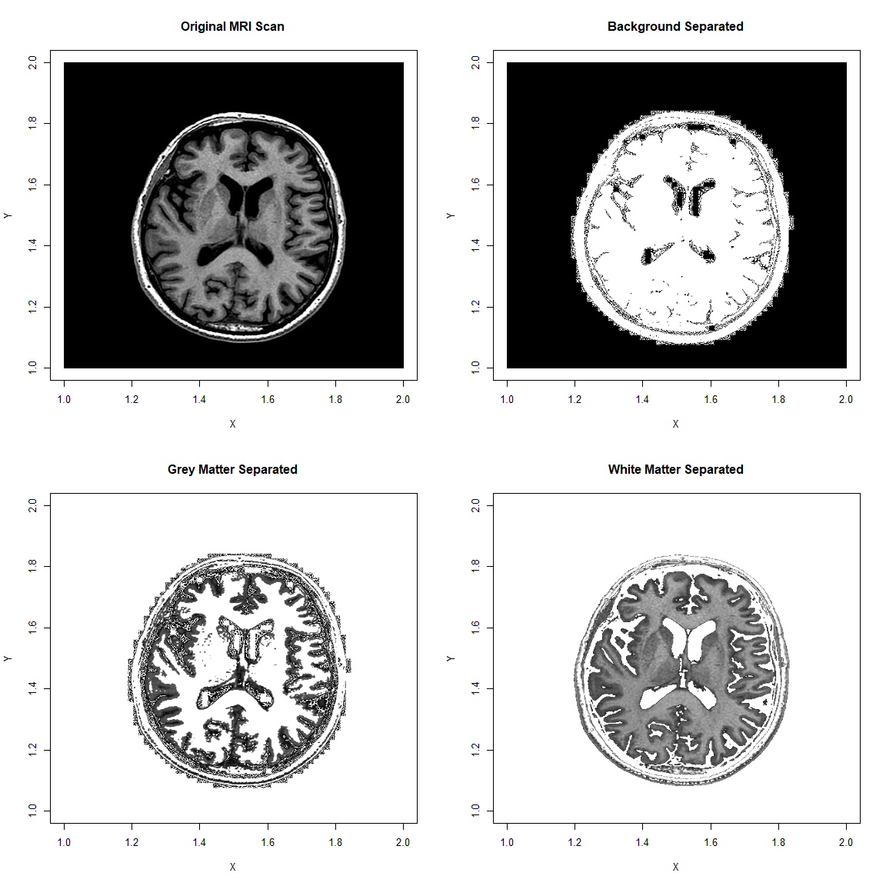
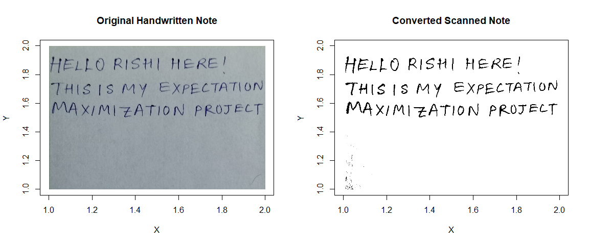

# INTRODUCTION

**Image Segmentaion is to divide the image into disjoint homogeneous regions or classes, where all the pixels in the same class must have some common characterestics**. With recent growth in image data in various fields like Medical Imaging- MRI images, fMRI images, X-Ray images, PET Scans, CT Scans, Ultrasound; Facial Recognition; Handwritten Notes Scans, etc it becomes important to devise a method to segment parts of image to study specific ROI(Region of Interests) in MRI, etc.

**A Grayscale(Color) image, afterall, is nothing but a(a set of) matrix(matrices) i.e. single channel(3 channels -RGB) of intensity values(0 to 1, both inclusive)**. So, there are parts of images with higher intensity and parts with lower intensity, parts of images which share common intensity pattern. So our goal is to exploit this feature of image to segment or classify the pixels.

# IDEA & ALGORITHM

Image is thought of as a random process, particularly, a mixture of random processes.

### MODEL ASSUMPTIONS:
- **pixels(intensity values) of an image to be coming from a Gaussian Mixture Model(GMM)**.
- **The Gaussians in the mixture model are independent**.
- **pixels are iid sample from the above mentioned GMM**.
The GMM model's pdf is given by-
$$f(x_i|\Phi) = \sum_{k=1}^{K}p_k.G(x_i|\theta_k)$$

Where K is the number of processes or classes that need to be extracted from the image, $\theta_k\ \forall\ k=1,2,\dots, K$ is a parameter vector of class  and its form $[\mu_k,\ \sigma_k]$ such that $\mu_k,\ \sigma_k$ are mean and standard deviation of the distribution $k$ with density $G_k(x|\theta_k)$, respectively, $p_k$ is mixing proportion of class $k$ ($0<p_k<1,\ \forall\ k=1,\dots,K$ and $\sum_kp_k=1$), $x_i$ is the intensity of pixel $i$, and $\Phi = \{p_1,\dots, p_k, \mu_1,\dots,\mu_k \}$ is called the parameters vector of the mixture.

**The parameter vector $\Phi$ is the missing data that defines the mixture**. The EM Algorithm utilize the maximum log-likelihood estimator to estimate the value of $\Phi$. The likelihood is given by,
$$L(\Phi) = f(x_1,\dots,x_n|\Phi) = \prod_{i=1}^n f(x_i|\Phi)$$
We use the EM-Algorithm to solve for $\Phi_{ML}$, which maximizes the likelihood (otherwise computationally expensive(sometimes intractable)) i.e.,
$$L(\Phi_{ML}) = arg\ max\ (L(\Phi))$$
Hence, $\Phi_{ML}$ is called the maximum log-likelihood estimato of $\Phi$.

### EXPECTATION MAXIMIZATION ALGORITHM

Once the true value of the parameters are found then the class of each pixel in the image can be easily determined by computing the probability of this pixel to be belong to each class in the image. The **EM algorithm is used to find the unknown parameters of a mixture model, that maximizes the log-likelihood of the sample**.

- The **Expectation(E) Step**:
Compute the expected value of $z_{ik}$ use the current estimate of the parameter vector $\Phi$,
$$z_{ik}^{(t)} = \frac{p_k^{(t)}.G(x_i|\theta_k^{(t)})}{f(x_i|\Phi^{(t)})}$$
Where $z_{ik}$ is the posteriori probability that given $x_i,\ x_i$ comes from class k. The $N\times K$ matrix $Z=[z_{ik}]$ of posteriori probability satisfies the constraints, ($0\leq z_{ik}\leq 1, \sum_k z_{ik} = 1, \sum_i z_{ik}>0, 1\leq i\leq N, 1\leq k\leq K$). $x_i$ is the value of the pixel $i$. $G(x_i|\theta_k^{(t)})$ is the probability of pixel i given it is a member of class k.

- The **Maximization(M) Step**:
Using the Expectation Step Data as if it were actually measured data,
$$\mu_k^{(t+1)} = \frac{\sum_{i=1}^N z_{ik}^{(t)}.x_i}{\sum_{i=1}^N z_{ik}^{(t)}}$$
$${\sigma^2_{k}}^{(t+1)} = \frac{\sum_{i=1}^N z_{ik}^{(t)}.(x_i-\mu^{(t+1)})^2}{\sum_{i=1}^{N} z_{ik}^{(t)}}$$
$$p_k^{(t+1)} = \frac{\sum_{i=1}^N z_{ik}^{(t)}}{N}$$
We keep on iterating the above two steps until the parameter estimates change in an iteration falls below some tolerance level or when NaN comes in the optimization after optimizing implying no further numerical optimization can be done.

- The **Classification Step**:
After we have applied EM-Algorithm and we have the parameter estimate, we use it to find the probability(density) at each point belonging to each of the $K$ class. Then, we **classify the point to be belonging to the class which attains the maximum probability(density) for that point out of the $K$ classes**.

# APPLICATION

Here we will apply the above described algorithm on some Brain MRI Images, etc.
- We have the following Brain MRI Image and taking a look at it we can visually see 3 different classes is the most probable i.e. the background, the CSF and the gray matter.

<!-- -->

-  We run the algorithm with K=3(3 clusters), tolerance of $10^{-3}$, maximum iteration of 4000. We get convergence as per the tolerance criteria, below we show the estimated Normals and their proportions as found by EM-Algorithm. Just by glancing we see that the proportion of the black pixels which is supposed to be coming from the degenerate normal model is 64%, and since most of the MRI Scan is black it seems okay. 

<!-- -->

- Now, coming to the most interesting part that is seeing the result of the segmentation. The Segmentation works almost perfectly and separates the required 3 parts without any manual intervention apart from deciding on the number of clusters, tolerance and iteration limit.
<!-- -->

- Let's Apply our Segmentation function on some other images, to see how well it works. One possible application of this technique can be to scan handwritten notes, sketches, etc. and from below it looks like a perfectly scanned note(We obv. used 2 clusters).

<!-- -->

# CONCLUSION

We used EM-Algorithm to Segment Image into sections which have common characteristics. This has the following advantages:

- It is computationally comparatively fast.
- Running few iterations works fine for most cases.
- Can use any number of clusters.
- Helps in study of ROI of an image(specially medical images).

Drawbacks:

- It models pixels as iid samples rather than taking advantage of the spatial correlation.
- Have to choose the number of clusters wisely.
- Produces granular segmented images sometimes(Due to the 1st Drawback).

